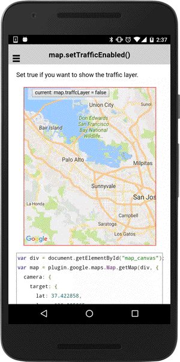

# map.setTrafficEnabled()

Set true if you want to show the traffic layer.

```typescript
map.setTrafficEnabled(flag)
```

## Parameters

name   | type    | description
-------|---------|---------------------------------------
flag   | boolean | `true`: enable traffic layer, `false`: hide it

----------------------------------------------------------------------------------------------------------

## Demo code

```html
<div class="map" id="map_canvas">
    <span class="smallPanel"><button>current: map.trafficLayer = false</button></span>
</div>
```

```typescript
map: GoogleMap;
isEnabled: boolean = false;

loadMap() {
  this.map = GoogleMaps.create('map_canvas', {
    target: {
      lat: 37.422858,
      lng: -122.085065
    },
    zoom: 10
  });
}

onButtonClick() {
  this.isEnabled = !this.isEnabled;
  map.setTrafficEnabled(isEnabled);
}

```


