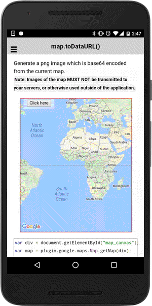

# map.toDataURL()

Generate a png image which is base64 encoded from the current map.

*Note: Images of the map **MUST NOT** be transmitted to your servers, or otherwise used outside of the application.*

```typescript
map.toDataURL(options)
```

## Parameters

name      | type                                              | description
----------|---------------------------------------------------|---------------------------------------
options   | [ToDataUrlOptions](../todataurloptions/README.md) | quality options

## Return value

:arrow_right: Returns `Promise<string>`

----------------------------------------------------------------------------------------------------------

## Demo code

```html
<div class="map" id="map_canvas">
    <span class="smallPanel"><button>Click here</button></span>
</div>
```

```typescript
map: GoogleMap;
isVisible: boolean = false;

loadMap() {
  this.map = GoogleMaps.create('map_canvas');
}

onButtonClick() {
  // Create a snap shot
  map.toDataURL.then(this.showImage.bind(this));
}

showImage(url: string) {
  // Show the image
  var bgDiv = document.createElement("div");
  bgDiv.style.position = "fixed";
  bgDiv.style.zIndex = 3;
  bgDiv.style.left = 0;
  bgDiv.style.top = 0;
  bgDiv.style.bottom = 0;
  bgDiv.style.right = 0;
  bgDiv.style.backgroundColor = "rgba(0,0,0,0.5)";

  var img = document.createElement("img");
  img.src = url;
  img.style.width = "75%";
  img.style.height = "auto";
  img.style.top = 0;
  img.style.left = 0;
  img.style.right = 0;
  img.style.bottom = 0;
  img.style.margin = "auto";
  img.style.position = "absolute";
  bgDiv.appendChild(img);

  bgDiv.addEventListener("click", function() {
    document.body.removeChild(bgDiv);
    bgDiv.removeEventListener("click", arguments.callee);
    bgDiv = null;
    img = null;
  });

  document.body.appendChild(bgDiv);

}
```


