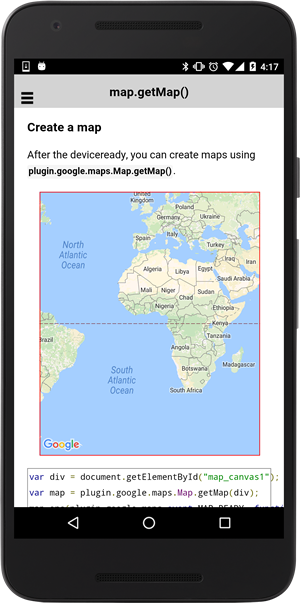
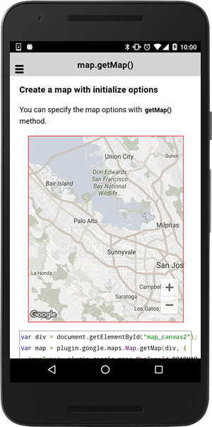
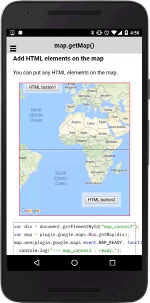

# GoogleMaps.create()

## Create a map

You can create a map view using `GoogleMaps.create(divId)`.

The cordova-plugin-googlemaps has two sides: `JavaScript` and `native`.

Since the native side initialization takes a kind of longer time than JavaScript side, the map fires the `MAP_READY` event when the map is fully ready.

```html
<div style="width:500px;height:500px" id="map_canvas1"></div>
```

```typescript
let map: GoogleMap = GoogleMaps.create('map_canvas1');
map.one(GoogleMapsEvent.MAP_READY).then(() => {
  console.log("--> map_canvas1 : ready.");
});
```



## Create a map with initialize options

You can specify options when you create a map.

Check out the available options at the [GoogleMapOptions](../googlemapoptions/README.md) method.

```typescript
let map:GoogleMap = GoogleMaps.create('map_canvas2', {
  'mapType': GoogleMapsMapTypeId.HYBRID,
  'controls': {
    'compass': true,
    //'myLocationButton': true,
    'indoorPicker': true
  },
  'gestures': {
    'scroll': true,
    'tilt': true,
    'rotate': true,
    'zoom': true
  },
  camera: {
    target : [
      {lat:41.79883, lng:140.75675},
      {lat:41.799240000000005, lng:140.75875000000002},
      {lat:41.797650000000004, lng:140.75905},
      {lat:41.79637, lng:140.76018000000002},
      {lat:41.79567, lng:140.75845},
      {lat:41.794470000000004, lng:140.75714000000002},
      {lat:41.795010000000005, lng:140.75611},
      {lat:41.79477000000001, lng:140.75484},
      {lat:41.79576, lng:140.75475},
      {lat:41.796150000000004, lng:140.75364000000002},
      {lat:41.79744, lng:140.75454000000002},
      {lat:41.79909000000001, lng:140.75465},
      {lat:41.79883, lng:140.75673}
    ],
    'tilt': 60,
    'bearing': 50
  }
});
map.one(GoogleMapsEvent.MAP_READY).then(() => {
  console.log("--> map_canvas2 : ready.");
});
```




## Put any HTML elements on the map

The one of the benefits of the cordova-plugin-googlemaps is you are able to put any HTML elements on the map.

```html
<div class="map" id="map_canvas3" style="position:relative">
  <span class="smallPanel">
    <button ion-button (click)="onButtonClick($event)">
    HTML button1
    </button>
  </span>
  <span class="smallPanel" style="position:absolute;bottom:1em;right:1em;">
    <button ion-button color="secondary" (click)="onButtonClick($event)">
    HTML button2
    </button>
  </span>
</div>
```

```typescript
let map: GoogleMap = GoogleMaps.create('map_canvas3');
map.one(GoogleMapsEvent.MAP_READY).then(() => {
  console.log("--> map_canvas3 : ready.");
});

onButtonClick(event) {
  console.log(event);
  alert(event.srcElement.innerText + ' is clicked');
}
```


