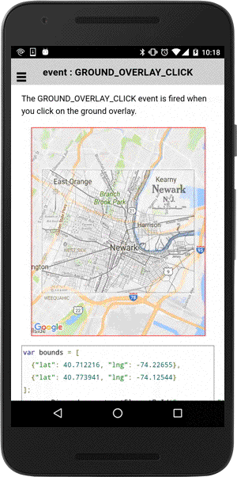

# GroundOverlay class

_This class extends [BaseClass](../baseclass/README.md)_.

## Contents

  - <a href="#overview">Overview</a>
    - <a href="#create-one-groundoverlay">Create one GroundOverlay</a>
    - <a href="#listen-click-event">Click event</a>
  - <a href="#api-reference">API Reference</a>

------------

## Overview

### Create one GroundOverlay

```typescript
map: GoogleMap;

loadMap() {

  let bounds: ILatLng[] = [
    {"lat": 40.712216, "lng": -74.22655},
    {"lat": 40.773941, "lng": -74.12544}
  ];

  this.map = GoogleMaps.create('map_canvas', {
    camera: {
      target: bounds
    }
  });

  // Add ground overlay
  let groundOverlay: GroundOverlay = this.map.addGroundOverlay({
    'url': "../images/newark_nj_1922.jpg",
    'bounds': bounds,
    'opacity': 0.5
  });
}
```


---------------------------------------------------------------

### Listen CLICK event

In order to listen the GROUND_OVERLAY_CLICK event, you need to specify the `clickable` option.
You can get the latitude/longitude pair of clicked position.

```typescript
let bounds: ILatLng[] = [
  {"lat": 40.712216, "lng": -74.22655},
  {"lat": 40.773941, "lng": -74.12544}
];

// Add ground overlay
let groundOverlay: GroundOverlay = this.map.addGroundOverlay({
  'url': "../images/newark_nj_1922.jpg",
  'bounds': bounds,
  'opacity': 0.5,
  'clickable': true  // default = false
});

// Catch the GROUND_OVERLAY_CLICK event
groundOverlay.on(GoogleMapsEvent.GROUND_OVERLAY_CLICK).subscribe((params: any[]) => {
  let latLng: ILatLng = params[0];
  ...
});
```




---------------------------------------------------------------
## API Reference
---------------------------------------------------------------

## Create methods

- ### map.addGroundOverlay() [:orange_book:](./addGroundOverlay/README.md)

  Adds a ground overlay onto the map **asynchronously**.

  :arrow_right: Returns `Promise<GroundOverlay>`

- ### map.addGroundOverlaySync() [:orange_book:](./addGroundOverlaySync/README.md)

  Adds a ground overlay onto the map **synchronously**.

  :arrow_right: Returns `GroundOverlay`


------------------------------------------------------------------------


## Instance methods

- ### getId()

  Returns the ID of instance.

  :arrow_right: Returns `string`

- ### getMap()

  Return the map instance.

  :arrow_right: Returns [GoogleMap](../googlemap/README.md) instance.

- ### setBounds(bounds) [:orange_book:](./setBounds/README.md)

  Changes the bounds of the GroundOverlay

  <table>
  <tr>
    <th>Params</th>
    <th>Type</th>
    <th>Details</th>
  </tr>
  <tr>
    <td>bounds</td>
    <td><a href="../ilatlng/README.md">ILatLng</a>[]</td>
    <td>new bounds</td>
  </tr>
  </table>


- ### setBearing(bearing) [:orange_book:](./setBearing/README.md)

  Changes the bearing of the ground overlay

  <table>
  <tr>
    <th>Params</th>
    <th>Type</th>
    <th>Details</th>
  </tr>
  <tr>
    <td>bearing</td>
    <td>number</td>
    <td>angle (clockwise)</td>
  </tr>
  </table>


- ### getBearing()

  Returns the current bearing value

  :arrow_right: Returns `number`.

- ### setImage(imageUrl) [:orange_book:](./setImage/README.md)

  Change the ground overlay image.

  <table>
  <tr>
    <th>Params</th>
    <th>Type</th>
    <th>Details</th>
  </tr>
  <tr>
    <td>imageUrl</td>
    <td>string</td>
    <td>URL of image</td>
  </tr>
  </table>


- ### setOpacity(opacity) [:orange_book:](./setOpacity/README.md)

  Changes the opacity of the ground overlay from 0.0 to 1.0

  <table>
  <tr>
    <th>Params</th>
    <th>Type</th>
    <th>Details</th>
  </tr>
  <tr>
    <td>opacity</td>
    <td>number</td>
    <td>from 0.0 to 1.0</td>
  </tr>
  </table>


- ### getOpacity()

  Returns the current opacity

  :arrow_right: Returns `number`.


- ### setClickable(clickable) [:orange_book:](./setClickable/README.md)

  Changes click-ability of the ground overlay

  <table>
  <tr>
    <th>Params</th>
    <th>Type</th>
    <th>Details</th>
  </tr>
  <tr>
    <td>clickable</td>
    <td>boolean</td>
    <td>true or false</td>
  </tr>
  </table>


- ### getClickable()

  Returns true if the ground overlay is clickable.

  :arrow_right: Returns `boolean`.

- ### setVisible(clickable) [:orange_book:](./setVisible/README.md)

  Set ground overlay visibility

  <table>
  <tr>
    <th>Params</th>
    <th>Type</th>
    <th>Details</th>
  </tr>
  <tr>
    <td>visible</td>
    <td>boolean</td>
    <td>true or false</td>
  </tr>
  </table>


- ### getVisible()

  Returns true if the ground overlay is visible.

  :arrow_right: Returns `boolean`.


- ### setZIndex(index) [:orange_book:](./setZIndex/README.md)

  Changes the ground overlay zIndex order.

  <table>
  <tr>
    <th>Params</th>
    <th>Type</th>
    <th>Details</th>
  </tr>
  <tr>
    <td>index</td>
    <td>number</td>
    <td>z-index</td>
  </tr>
  </table>


- ### getZIndex()

  Returns the current ground overlay zIndex.

  :arrow_right: Returns `number`.

- ### remove()

  Remove the ground overlay.


------------------------------------------------------------------------

## Event

- ### GROUND_OVERLAY_CLICK [:orange_book:](./GROUND_OVERLAY_CLICK/README.md)

  This event is fired when you click on a ground overlay.

  <table>
  <tr>
    <th>Params</th>
    <th>Type</th>
    <th>Details</th>
  </tr>
  <tr>
    <td>params[0]</td>
    <td>LatLng</td>
    <td>clicked position</td>
  </tr>
  <tr>
    <td>params[1]</td>
    <td>GroundOverlay</td>
    <td>ground overlay instance</td>
  </tr>
  </table>
