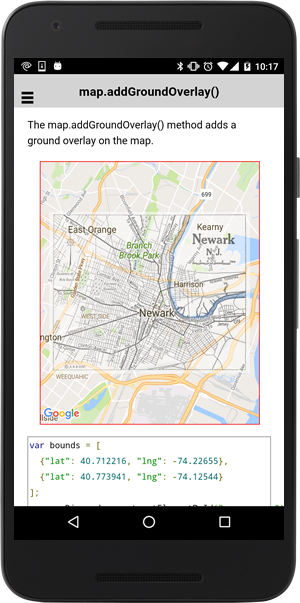

# map.addGroundOverlaySync()

The map.addGroundOverlaySync() method adds a ground overlay on the map **synchronously**.

```typescript
map.addGroundOverlaySync(options);
```

## Parameters

name           | type                                                    | description
---------------|---------------------------------------------------------|---------------------------------------
options        | [GroundOverlayOptions](../../groundoverlayoptions/README.md)   | ground overlay options


## Return value

:arrow_right: Returns `GroundOverlay`


----------------------------------------------------------------------------------------------------------


## Demo code

```html
<div id="map_canvas"></div>
```

```typescript
map: GoogleMap;

loadMap() {

  let bounds: ILatLng[] = [
    {"lat": 40.712216, "lng": -74.22655},
    {"lat": 40.773941, "lng": -74.12544}
  ];
  this.map = GoogleMaps.create('map_canvas', {
    camera: {
      target: bounds
    }
  });

  // Add ground overlay
  let groundOverlay: GroundOverlay = this.map.addGroundOverlay({
    'url': "../images/newark_nj_1922.jpg",
    'bounds': bounds,
    'opacity': 0.5
  });
}
```


