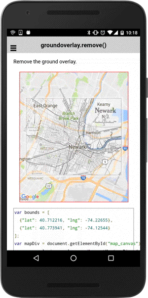

# groundOverlay.remove()

Remove the ground overlay.

```
groundOverlay.remove()
```

------------------------------------------------------------------------------------------

## Demo code

```html
<div id="map_canvas"></div>
```

```typescript
map: GoogleMap;

loadMap() {
  let bounds: ILatLng[] = [
    {"lat": 40.712216, "lng": -74.22655},
    {"lat": 40.773941, "lng": -74.12544}
  ];

  this.map = GoogleMaps.create("map_canvas", {
    camera: {
      target: bounds
    }
  });

  // Add ground overlay
  let groundOverlay: GroundOverlay = this.map.addGroundOverlaySync({
    'url': "assets/newark_nj_1922.jpg",
    'bounds': bounds,
    'opacity': 0.5,
    'clickable': true  // default = false
  });

  // Catch the GROUND_OVERLAY_CLICK event
  groundOverlay.one(GoogleMapsEvent.GROUND_OVERLAY_CLICK).then(() => {
    groundOverlay.remove();
  });

}
```


