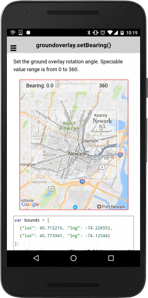

# groundOverlay.setBearing()

Set the ground overlay rotation angle. The value range is from 0 to 360.

```
groundOverlay.setBearing(bearing);
```


## Parameters

name           | type          | description
---------------|---------------|---------------------------------------
bearing        | number        | new center position
-----------------------------------------------------------------------


## Demo code

```html
<div id="map_canvas">
  <ion-list>
    <ion-item>
      <ion-label>bearing</ion-label>
      <ion-range id="bearing" min="0" max="360" step="10" color="secondary"  snaps="true" ></ion-range>
    </ion-item>
  </ion-list>
</div>

```typescript
map: GoogleMap;
bearing: number = 0;
groundOverlay: GroundOverlay = null;

loadMap() {
  let bounds: ILatLng[] = [
    {"lat": 40.712216, "lng": -74.22655},
    {"lat": 40.773941, "lng": -74.12544}
  ];

  this.map = GoogleMaps.create("map_canvas", {
    camera: {
      target: bounds
    }
  });

  // Add ground overlay
  this.groundOverlay = this.map.addGroundOverlaySync({
    'url': "assets/newark_nj_1922.jpg",
    'bounds': bounds,
    'opacity': 0.5
  });

}

onBearingChange() {
  if (this.groundOverlay) {
    this.groundOverlay.setBearing(this.bearing);
  }
}
```


