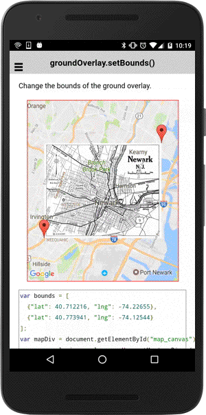

# groundOverlay.setBounds()

Change the bounds of the ground overlay.

```
groundOverlay.setBounds(bounds);
```


## Parameters

name           | type          | description
---------------|---------------|---------------------------------------
bounds         | ILatLng[2]    | new southWest and northEast
-----------------------------------------------------------------------


## Demo code

```html
<div id="map_canvas"></div>
```

```typescript
map: GoogleMap;
groundOverlay: GroundOverlay;
markers: Marker[] = [];

loadMap() {
  let bounds: ILatLng[] = [
    {"lat": 40.712216, "lng": -74.22655},
    {"lat": 40.773941, "lng": -74.12544}
  ];

  this.map = GoogleMaps.create("map_canvas", {
    camera: {
      target: bounds
    }
  });

  // Add ground overlay
  this.groundOverlay = this.map.addGroundOverlaySync({
    'url': "assets/newark_nj_1922.jpg",
    'bounds': bounds,
    'opacity': 0.5
  });

  bounds.forEach((position: ILatLng) => {

    let marker: Marker = this.map.addMarkerSync({
      'position': position,
      'draggable': true
    });
    marker.on("position_changed").subscribe(this.onPositionChanged.bind(this));

    this.markers.push(marker);
  });

}

onPositionChanged(params: any[]) {
  // params = [ oldPositon: ILatLng, newPositon: ILatLng, marker: Marker]
  let marker: Marker = params.pop();

  this.groundOverlay.setBounds([
    this.markers[0].getPosition(),
    this.markers[1].getPosition()
  ]);
}
```


