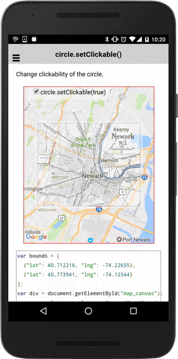

# groundOverlay.setClickable()

Enables or disables click events for this groundOverlay.

```
groundOverlay.setClickable(flag);
```


## Parameters

name           | type          | description
---------------|---------------|---------------------------------------
flag           | boolean       | `true`: clickable, `false`: non-clickable
-----------------------------------------------------------------------

## Demo code
```html
<div id="map_canvas">
  <span class="smallPanel"><input type="checkbox" (click)="toggleClickable()" checked="checked">groundOverlay.setClickable(true)</span>
</div>
```

```typescript
map: GoogleMap;
groundOverlay: GroundOverlay;

loadMap() {

  let bounds: ILatLng[] = [
    {"lat": 40.712216, "lng": -74.22655},
    {"lat": 40.773941, "lng": -74.12544}
  ];
  this.map = GoogleMaps.create('map_canvas', {
    camera: {
      target: bounds,
      padding: 40
    }
  });

  // All gestures (such as pinch-zooming) are disabled.
  this.map.setAllGesturesEnabled(false);

  // Add ground overlay
  this.groundOverlay = this.map.addGroundOverlaySync({
    'url': "../images/newark_nj_1922.jpg",
    'bounds': bounds,
    'opacity': 0.5,
    'clickable': true // default = false
  });

  // Catch the GROUND_OVERLAY_CLICK event
  this.groundOverlay.on(GoogleMapsEvent.GROUND_OVERLAY_CLICK).subscribe(() => {
    alert("The ground overlay is clicked!");
  });
}

toggleClickable() {
  // Change the clickable property
  this.groundOverlay.setClickable(!this.groundOverlay.getClickable());
}
```


