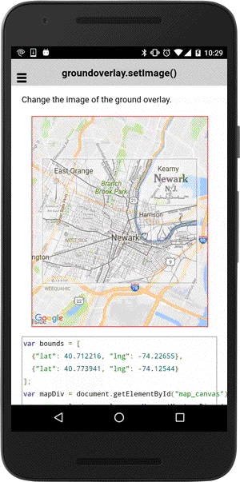

# groundOverlay.setImage()

Change the image of the ground overlay.

```
groundOverlay.setImage(url);
```


## Parameters

name           | type          | description
---------------|---------------|---------------------------------------
url            | string        | image url or path
-----------------------------------------------------------------------


## Demo code

```html
<div id="map_canvas"></div>
```

```typescript

map: GoogleMap;
groundOverlay: GroundOverlay;

loadMap() {

  let bounds: ILatLng[] = [
    {"lat": 40.712216, "lng": -74.22655},
    {"lat": 40.773941, "lng": -74.12544}
  ];
  this.map = GoogleMaps.create('map_canvas', {
    camera: {
      target: bounds
    }
  });

  // All gestures (such as pinch-zooming) are disabled.
  this.map.setAllGesturesEnabled(false);

  // Add ground overlay
  this.groundOverlay = this.map.addGroundOverlaySync({
    'url': "../images/newark_nj_1922.jpg",
    'bounds': bounds,
    'opacity': 0.5,
    'clickable': true // default = false
  });

  // Catch the GROUND_OVERLAY_CLICK event
  this.groundOverlay.on(GoogleMapsEvent.GROUND_OVERLAY_CLICK).subscribe(() => {
    // Change the image url.
    groundOverlay.setImage("../images/newark_nj_1922_2.jpg");
  });
}
```


