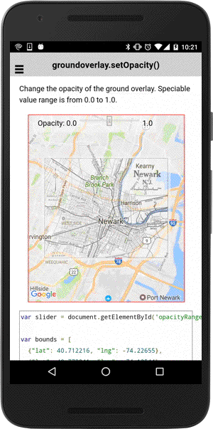

# groundOverlay.setOpacity()

Change the opacity of the ground overlay. The value range is from 0.0 to 1.0.

```
groundOverlay.setOpacity(opacity);
```


## Parameters

name           | type          | description
---------------|---------------|---------------------------------------
opacity        | number        | opacity from 0.0 to 1.0
-----------------------------------------------------------------------


## Demo code

```html
<div id="map_canvas">
  <ion-list>
    <ion-item>
      <ion-label>opacity</ion-label>
      <ion-range id="opacity" min="0" max="1" step="0.1" color="secondary"  snaps="true" value="0.5"></ion-range>
    </ion-item>
  </ion-list>
</div>
```

```typescript
opacity: number = 0;

loadMap() {
  let bounds: ILatLng[] = [
    {"lat": 40.712216, "lng": -74.22655},
    {"lat": 40.773941, "lng": -74.12544}
  ];

  this.map = GoogleMaps.create("map_canvas", {
    camera: {
      target: bounds,
      padding: 40
    }
  });

  // All gestures (such as pinch-zooming) are disabled.
  this.map.setAllGesturesEnabled(false);


  // Add ground overlay
  this.groundOverlay = this.map.addGroundOverlaySync({
    'url': "assets/newark_nj_1922.jpg",
    'bounds': bounds,
    'opacity': 0.5
  });

}

onOpacityChange() {
  if (this.groundOverlay) {
    // If the slider is moved, change the ground overlay opacity.
    this.groundOverlay.setOpacity(this.opacity);
  }
}
```


