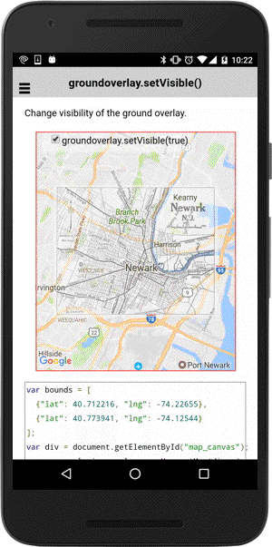

# groundOverlay.setVisible()

Change visibility of the ground overlay.

```
groundOverlay.setVisible(flag);
```

## Parameters

name           | type          | description
---------------|---------------|---------------------------------------
flag           | boolean       | `true`: visible, `false`: invisible
-----------------------------------------------------------------------

## Demo code

```html
<div id="map_canvas">
  <span class="smallPanel"><input type="checkbox" id="toggleCheckbox" checked="checked">groundoverlay.setVisible(true)</span>
</div>
```

```typescript
var bounds = [
  {"lat": 40.712216, "lng": -74.22655},
  {"lat": 40.773941, "lng": -74.12544}
];
var div = document.getElementById("map_canvas");
var map = plugin.google.maps.Map.getMap(div, {
  camera: {
    target: bounds,
    padding: 40
  }
});

// All gestures (such as pinch-zooming) are disabled.
map.setAllGesturesEnabled(false);

// Add ground overlay
var groundOverlay = map.addGroundOverlay({
  'url': "../images/newark_nj_1922.jpg",
  'bounds': bounds,
  'opacity': 0.5
});

var checkbox = document.getElementById("toggleCheckbox");
checkbox.addEventListener("change", function() {

  // Change the visible property
  groundOverlay.setVisible(checkbox.checked);

});

```


