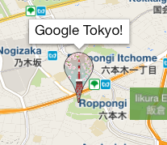
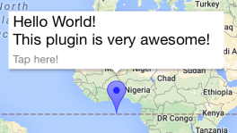
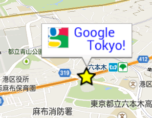

# MarkerIcon interface

**[usage 1]SimpleIcon**

```typescript
let icon: MarkerIcon = {
  url: 'assets/google_tokyo_icon.png',
  size: {
    width: 32,
    height: 24
  }
};

this.map.addMarker({
  'position': {lat: ..., lng: ...},
  'icon': icon
}).then((marker: Marker) => {

});
```



**[usage 2]Color Icon**

```typescript
this.map.addMarker({
  'position': {lat: ..., lng: ...},
  'icon': 'blue'
}).then((marker: Marker) => {

});
```



**[usage 3]Base64 Encoded Icon**

```typescript
let icon: string = "data:image/png;base64,iVBORw0KGgo...CC";
let canvas: any = document.createElement('canvas');
canvas.width = 120;
canvas.height = 40;
let context: any = canvas.getContext('2d');

let img: any = new Image();
img.src = "assets/google_logo.gif";
img.onload = () => {
  context.drawImage(img, 0, 0);

  context.font = '15pt Calibri';
  context.fillStyle = 'blue';
  context.fillText('Google', 40, 15);
  context.fillText('Tokyo!', 60, 35);

  this.map.addMarker({
    'position': latLng,
    'title': canvas.toDataURL(),
    'icon': icon
  }).then((marker: Marker) => {
    marker.showInfoWindow();
  });
};
```



## Interface members

<table>
<tr>
  <th>Params</th>
  <th>Type</th>
  <th>Details</th>
</tr>
<tr>
  <td>url</td>
  <td>string</td>
  <td>`http`, `https`, `file`, `cdvfile` and `file` protocols are supported.</td>
</tr>
<tr>
  <td>size</td>
  <td>{<br>
&nbsp;&nbsp;width: number,<br>
&nbsp;&nbsp;height: number,<br>
}</td>
  <td>(optional) size of the icon image</td>
</tr>
</table>
