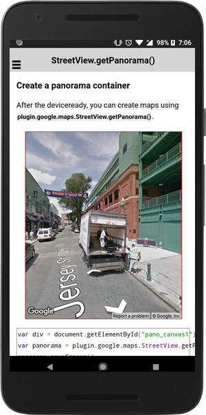
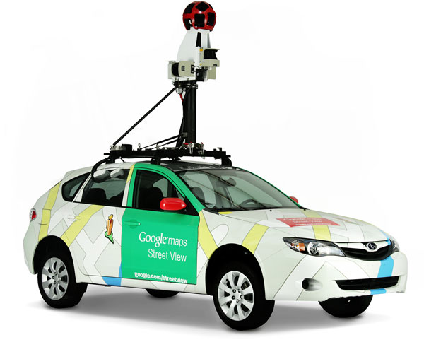
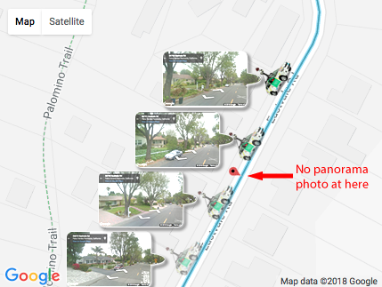
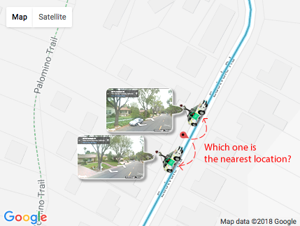
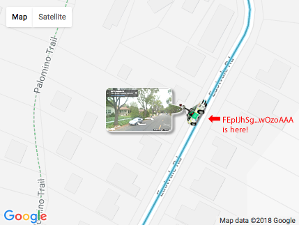

# StreetViewPanorama class

_This class extends [BaseClass](../BaseClass/README.md)_.

## Contents

  - <a href="#overview">Overview</a>
    - <a href="#create-a-streetview-panorama">Create a Street View Panorama</a>
    - <a href="#the-panorama_location_change-event">PANORAMA_LOCATION_CHANGE</a>
    - <a href="#panorama-id">Panorama id</a>
  - <a href="#api-reference">API Reference</a>

---------------------------------------------------------------


## Overview

Google Street View provides panoramic 360 degree views from designated roads throughout its coverage area.
Street View's API coverage is the same as that for the Google Maps application (https://maps.google.com/).
The list of currently supported cities for Street View is available at the [Google Maps website](https://www.google.com/streetview/understand/#where).


---------------------------------------------------------------

### Create a Street View Panorama

You can create a panorama view using `GoogleMaps.createPanorama(div)`.

```html
<div class="pano" id="pano_canvas1"></div>
```

```typescript
let panorama: StreetViewPanorama = GoogleMaps.createPanorama('pano_canvas');

panorama.setPosition({
  target: {lat: 42.345573, lng: -71.098326}
});
```




---------------------------------------------------------------

### The `PANORAMA_LOCATION_CHANGE` event

Google takes panorama photos with special camera device on moving.
Not only special car, but also they uses Trekker, Trolly, Bike, Snow mobile,... etc.



Since they takes panorama photos on moving periodically, there is no panorama photo between two locations that are taken photos.



For this reason, you can specify camera location, but the native API snaps to nearest available camera location.
The `PANORAMA_LOCATION_CHANGE` event gives the information where the location is.

```typescript
let panorama: StreetViewPanorama = GoogleMaps.createPanorama('pano_canvas');

panorama.setPosition({
  target: {lat: 42.345573, lng: -71.098326}
});

panorama.on(GoogleMapsEvent.PANORAMA_LOCATION_CHANGE).subscribe((params: any[]) => {
  let location: StreetViewLocation = params[0];

  let panoId:string = location.panoId;    // unique location id

  let position: ILatLng = location.latLng;  // lat,lng pair

  let links: StreetViewNavigationLink[] = location.links;      // links to the next available locations.
                                                               // The same as white arrow in panorama.

});

```


---------------------------------------------------------------

### Panorama id

Panorama id (panoId) is unique identify for each panorama location.

This panoId is able to use for [Street View Service](https://developers.google.com/maps/documentation/javascript/streetview) and [Google StreetView Image API](https://developers.google.com/maps/documentation/streetview/intro).

As described in [The `PANORAMA_LOCATION_CHANGE` event](#the-panorama_location_change-event) section, the Google Maps native API searches the nearest location in 50 meters from you requested. This is mostly fine, but this might display unexpected panorama if you want to display particular location. Because Google updates panorama photos every once in a while.



Using panoId avoids this trouble. Since the panoId is bounded to a particular panorama photo (location), you can always display exactly what you want.

```
panorama.setPosition({
  'target': 'FEpIJhSgQJOQCL3wOzoAAA'
})
```
**Note that the above is dummy id.**



However, this panoId is **NOT** permanent Id. If Google updates new panorama photos, new panorama id is generated, and older id is no longer available.

---------------------------------------------------------------
## API Reference
---------------------------------------------------------------

### Methods

  - ### setPosition(panoId | newPosition)

    Sets the current LatLng position for the Street View panorama.

    <table>
    <tr>
      <th>Params</th>
      <th>Type</th>
      <th>Details</th>
    </tr>
    <tr>
      <td>locationA</td>
      <td>String | <a href="../streeviewsetpositionoption/README.md">StreetViewSetPositionOption</a></td>
      <td>origin</td>
    </tr>
    </table>

  - ### setPov(pov)

    Sets the point of view for the Street View panorama.

    <table>
    <tr>
      <th>Params</th>
      <th>Type</th>
      <th>Details</th>
    </tr>
    <tr>
      <td>pov</td>
      <td><a href="../streetviewcamerapano/README.md">StreetViewCameraPano</a></td>
      <td>new camera POV</td>
    </tr>
    </table>

  - ### setPanningGesturesEnabled(gestureEnable)

    Toggles the ability for users to use pan around on the panorama using gestures.

    <table>
    <tr>
      <th>Params</th>
      <th>Type</th>
      <th>Details</th>
    </tr>
    <tr>
      <td>gestureEnable</td>
      <td>boolean</td>
      <td>Set false if you want to be disable panning gesture (default: true)</td>
    </tr>
    </table>

  - ### getPanningGesturesEnabled()

    Return true if panning gesture is enabled.

    :arrow_right: `boolean`

  - ### setZoomGesturesEnabled(zoomEnabled)

    Determines whether the user will be able to pinch to zoom.

    <table>
    <tr>
      <th>Params</th>
      <th>Type</th>
      <th>Details</th>
    </tr>
    <tr>
      <td>gestureEnable</td>
      <td>boolean</td>
      <td>Set false if you want to be disable zooming gesture (default: true)</td>
    </tr>
    </table>

  - ### getZoomGesturesEnabled()

    Return true if zooming gesture is enabled.

    :arrow_right: `boolean`

  - ### setNavigationEnabled(navigationEnabled)

    Determines whether the user will be able to move to a different panorama. Users can use a single tap on navigation links, or double tap the view, to move to a new panorama.

    <table>
    <tr>
      <th>Params</th>
      <th>Type</th>
      <th>Details</th>
    </tr>
    <tr>
      <td>gestureEnable</td>
      <td>boolean</td>
      <td>Set false if you want to hide navigation link (default: true)</td>
    </tr>
    </table>

  - ### getNavigationEnabled()

    Return true if the navigation control is enabled.

    :arrow_right: `boolean`

  - ### setStreetNamesEnabled(linkEnabled)

    Determines whether the user is able to see street names displayed on the ground.

    <table>
    <tr>
      <th>Params</th>
      <th>Type</th>
      <th>Details</th>
    </tr>
    <tr>
      <td>linkEnabled</td>
      <td>boolean</td>
      <td>Set false if you want to hide navigation link (default: true)</td>
    </tr>
    </table>

  - ### getStreetNamesEnabled()

    Returns true if the street name label is enable.

    :arrow_right: `boolean`

  - ### getLocation()

    Returns the current location

    :arrow_right: [StreetViewLocation](../streetviewlocation/README.md)

  - ### getPanoId()

    Returns the panorama ID of current location

    :arrow_right: string

  - ### getPosition()

    Return the current position (StreetViewLocation.latLng)

    :arrow_right: [ILatLng](../ilatlng/README.md)

  - ### getLinks()

    Return links of the last panorama location.

    :arrow_right: [StreetViewNavigationLink](../streetviewnavigationlink/README.md)

  - ### remove()

    Destroy a panorama view completely

------------------------------------------------------------------------

## Event

  - ### PANORAMA_READY

    This event is fired when the native panorama view is fully ready.

    <table>
    <tr>
      <th>Params</th>
      <th>Type</th>
      <th>Details</th>
    </tr>
    <tr>
      <td>params[0]</td>
      <td>StreetViewPanorama</td>
      <td>panorama instance</td>
    </tr>
    </table>

  - ### PANORAMA_LOCATION_CHANGE

    This event is fired when the panorama camera is moved to different location.
    <table>
    <tr>
      <th>Params</th>
      <th>Type</th>
      <th>Details</th>
    </tr>
    <tr>
      <td>params[0]</td>
      <td><a href="../streetviewlocation/README.md">StreetViewLocation</a></td>
      <td>new camera location</td>
    </tr>
    <tr>
      <td>params[1]</td>
      <td>StreetViewPanorama</td>
      <td>panorama instance</td>
    </tr>
    </table>

  - ### PANORAMA_CAMERA_CHANGE

    This event is fired when the panorama camera POV is changed.

    <table>
    <tr>
      <th>Params</th>
      <th>Type</th>
      <th>Details</th>
    </tr>
    <tr>
      <td>params[0]</td>
      <td><a href="../streetviewcameraposition/README.md">StreetViewCameraPosition</a></td>
      <td>new camera POV</td>
    </tr>
    <tr>
      <td>params[1]</td>
      <td>StreetViewPanorama</td>
      <td>panorama instance</td>
    </tr>
    </table>

  - ### PANORAMA_CLICK

    This event is fired when you click on panorama.

    <table>
    <tr>
      <th>Params</th>
      <th>Type</th>
      <th>Details</th>
    </tr>
    <tr>
      <td>params[0]</td>
      <td>[x: number, y: number]</td>
      <td>clicked position in pixels</td>
    </tr>
    <tr>
      <td>params[1]</td>
      <td>StreetViewPanorama</td>
      <td>panorama instance</td>
    </tr>
    </table>
